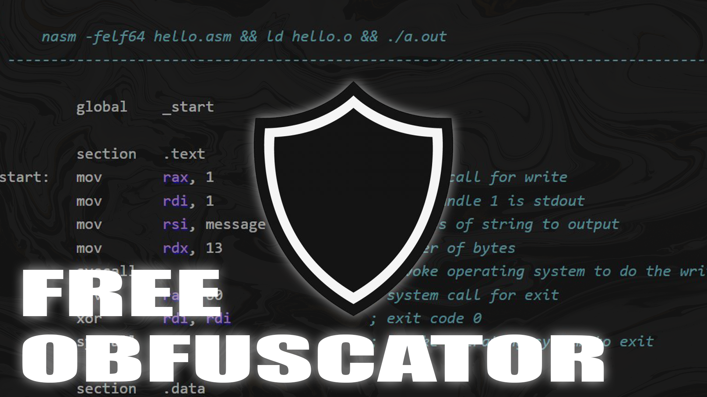
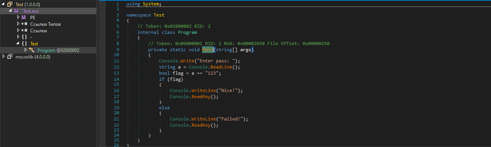
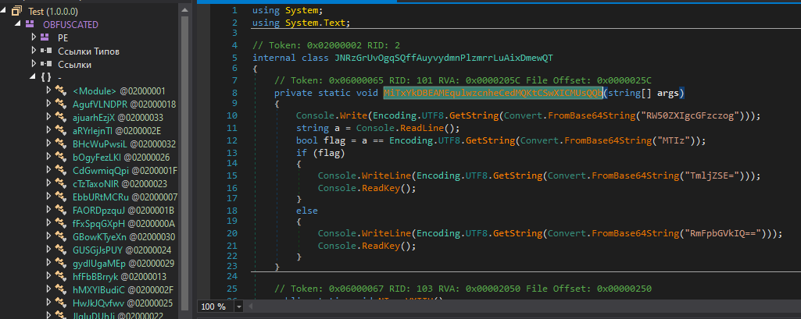
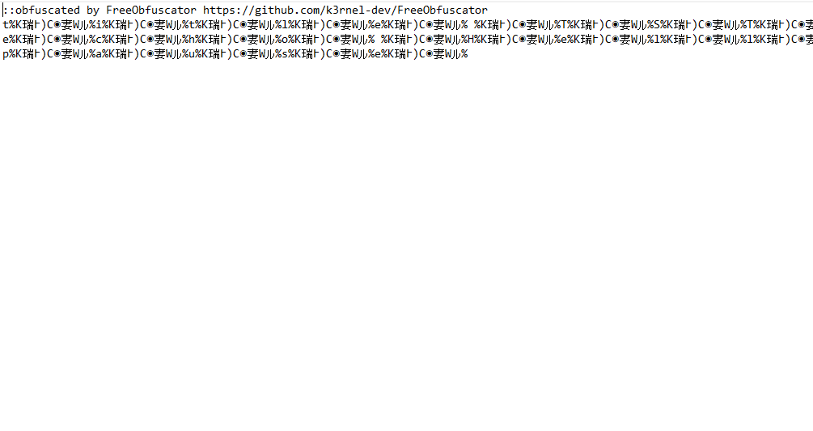
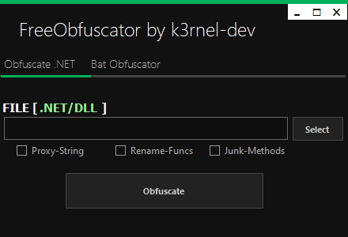

# FreeObfuscator



## 📑 About
<b> Simple Obfuscator for .NET-Files | .BAT files!</b>

### 💾 Features:
 * ProxyString
 * Junk-Methods
 * Rename-Functions
 * Bat-Files obfuscate

## 💻 .NET Obfuscate
<p float="left" align="center">
  
  
</p> 

## 💾 .BAT Obfuscate
<p float="left" align="center">
  
</p> 

## 💽 Program-Review
<p float="left" align="center">
  
</p> 

## ⚠️ Disclaimer
```
This project for education and purposes only!
```